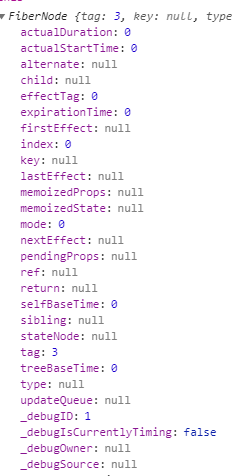
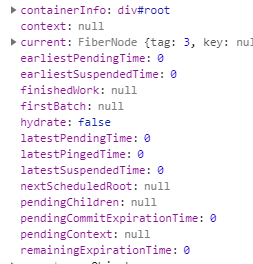

# ReactDom

## render

### render(ReactElement,Container:HtmlElement, callback: Function)

invoke legacyRenderSubtreeIntoContainer, null, element, container, false, callback

    validate: container
        container is HtmlElement or Document or Fragment or (Comment and value is ' react-mount-point-unstable ')

invoke topLevelUpdateWarnings, container

    check container is react-mount-point-unstable
        then check the container had removed not by ReactDOM.unmountComponentAtNode
        rootEl = get the root ReactElement from container.firstChild or document.documentElement

    check has init
        if not:
            invoke legacyCreateRootFromDOMContainer, container, forceHydrate(false)
                remove all child in container
                return ReactRoot(container, false,hydrate)
                    createContainer,container, false,hydrate
                        createFiberRoot,containerInfo, isAsync, hydrate
                            uninitializedFiber = createHostRootFiber(isAsync)
                                createFiber(HostRoot, null, null, isAsync ? AsyncMode | StrictMode : NoContext)
                                    FiberNode(tag,pendingProps, key, mode); args sort is same as callee
                                    <!-- Object.preventExtensions -->
                                    
                            init root =  container._reactRootContainer :   
                            invoke root.render(children,callback): ReactRoot.prototype.render
                                work = ReactWork();

## other

- ReactWork 一个事件队列  类似于 Promise
- FiberNode 重点
- updateClassComponent
  - constructClassInstance
    - getDerivedStateFromProps
  - mountClassInstance
  - finishClassComponent

- completeRoot